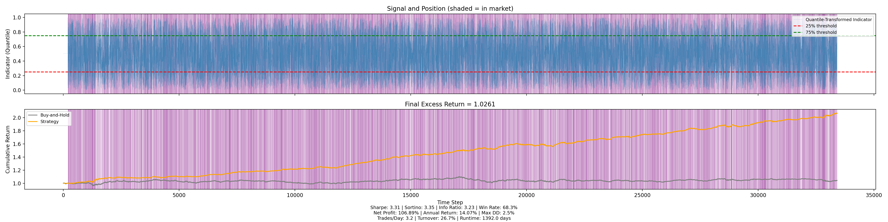

# LLM-Driven Scientific Discovery Technical Strategies for Forex

## Overview

This repository implements a novel, adaptive technical indicator discovered through an LLM-driven scientific discovery workflow. The indicator synthesizes multi-horizon momentum, volatility regime detection, tail-risk adjustment, and Gaussian-weighted trend filtering to generate a normalized trading signal for the AUDNZD currency pair on hourly data. The parameters of the discovered trading strategy are not tuned.

## Results

Below is the equity curve generated by applying this strategy to AUDNZD hourly data (rolling windows of length=200 are fed to the below technical_indicator function to generate signals, and then positions are taken by thresholding values generated by the technical indicator.)



## Technical Indicator Code

```python
import torch
import torch.nn.functional as F

def technical_indicator(ohlcv: torch.Tensor) -> torch.Tensor:
    eps = 1e-06
    if ohlcv.size(0) == 0:
        return torch.zeros(0, device=ohlcv.device)
    (n_assets, T, feat) = ohlcv.shape
    close = ohlcv[..., 3]
    log_close = torch.log(close + eps)
    returns = log_close - torch.cat([log_close[:, :1], log_close[:, :-1]], dim=1)
    min_req = 15
    if T < min_req:
        pad_amt = min_req - T
        returns = F.pad(returns, (pad_amt, 0), mode='replicate')
        T = returns.size(1)
    base_win = T if T < 20 else 20
    recent_vol = returns[:, -base_win:].std(dim=1)
    vol_med = torch.median(recent_vol)
    vol_std = recent_vol.std() + eps
    regime = (recent_vol > vol_med).float()
    d_param = torch.clamp(0.5 + 0.1 * ((recent_vol - vol_med) / vol_std) + regime * 0.1, 0.2, 0.9)
    accel = torch.zeros(n_assets, device=ohlcv.device, dtype=returns.dtype)
    if T >= 3:
        accel = 0.5 * (returns[:, -1] - returns[:, -2]) + 0.5 * (returns[:, -2] - returns[:, -3])
    vol_factor = torch.clamp(vol_med / (recent_vol + eps), 0.7, 1.3)
    min_win = 10
    max_win = min(60, T)
    wins = torch.arange(min_win, max_win + 1, device=ohlcv.device)
    missing = max_win - T
    if missing > 0:
        returns_pad = F.pad(returns, (missing, 0), mode='replicate')
    else:
        returns_pad = returns
    sig_list = []
    wt_list = []
    for w in wins.tolist():
        unr = returns_pad.unfold(dimension=1, size=w, step=1)
        last_unr = unr[:, -1, :]
        t_lin = torch.linspace(0, 1, steps=w, device=ohlcv.device, dtype=returns.dtype)
        weights = torch.softmax(-d_param.unsqueeze(1) * (1 - t_lin), dim=-1)
        moment = (last_unr * weights).sum(dim=1) * vol_factor
        q = torch.quantile(last_unr, 0.05, dim=1, keepdim=True)
        neg_mask = last_unr < q
        cvar = (last_unr * neg_mask.float()).sum(dim=1) / (neg_mask.sum(dim=1).float() + eps)
        tail_risk = torch.sigmoid(-cvar)
        mean_last = last_unr.mean(dim=1, keepdim=True)
        std_last = last_unr.std(dim=1, keepdim=True) + eps
        skew = ((last_unr - mean_last) ** 3).mean(dim=1) / (std_last.squeeze(1) ** 3 + eps)
        kurt = ((last_unr - mean_last) ** 4).mean(dim=1) / (std_last.squeeze(1) ** 4 + eps) - 3
        alpha = torch.sigmoid((recent_vol - vol_med) / (vol_std + eps))
        beta = 1 - alpha
        comb = alpha * moment + beta * accel + 0.1 * torch.tanh(skew) - 0.1 * torch.tanh(kurt)
        scale = F.softplus((recent_vol - vol_med) * vol_factor)
        sig = torch.exp(-(comb * scale) ** 2) * tail_risk
        sig_list.append(sig)
        win_std = last_unr.std(dim=1)
        wt = 1.0 / (win_std ** 2 + eps)
        wt_list.append(wt)
    S = torch.stack(sig_list, dim=0)
    W = torch.stack(wt_list, dim=0)
    dyn_w = torch.softmax(-W, dim=0)
    multi = (S * dyn_w).sum(dim=0)
    t_idx = torch.arange(T, device=ohlcv.device, dtype=returns.dtype)
    overall_mean = returns.mean(dim=1, keepdim=True)
    overall_std = returns.std(dim=1, keepdim=True) + eps
    asset_skew = ((returns - overall_mean) ** 3).mean(dim=1) / (overall_std.squeeze(1) ** 3 + eps)
    bw_fast = (0.5 + T / 20.0) * (vol_med / (recent_vol + eps)) * (1 + torch.abs(asset_skew))
    bw_med = bw_fast * 1.5
    bw_slow = bw_fast * 2.0
    center = T - 1
    diff = (t_idx - center).unsqueeze(0)
    gauss_fast = torch.exp(-0.5 * (diff / (bw_fast.unsqueeze(1) + eps)) ** 2)
    gauss_med = torch.exp(-0.5 * (diff / (bw_med.unsqueeze(1) + eps)) ** 2)
    gauss_slow = torch.exp(-0.5 * (diff / (bw_slow.unsqueeze(1) + eps)) ** 2)
    norm_fast = gauss_fast.sum(dim=1, keepdim=True) + eps
    norm_med = gauss_med.sum(dim=1, keepdim=True) + eps
    norm_slow = gauss_slow.sum(dim=1, keepdim=True) + eps
    ema_fast = (returns * gauss_fast).sum(dim=1) / norm_fast.squeeze(1)
    ema_med = (returns * gauss_med).sum(dim=1) / norm_med.squeeze(1)
    ema_slow = (returns * gauss_slow).sum(dim=1) / norm_slow.squeeze(1)
    trend = torch.exp(-(ema_fast - ema_med) ** 2 * 10.0) * torch.exp(-(ema_med - ema_slow) ** 2 * 10.0)
    med_ret = torch.median(returns[:, -1])
    cross = torch.sigmoid(-8.0 * (returns[:, -1] - med_ret) / (returns.std(dim=1) + eps))
    agg = torch.pow(multi * trend * cross + eps, 1.0 / 3.0)
    return torch.sigmoid(10.0 * (agg - 0.5))
```

## Strategy Description

1. **Volatility Regime Detection**

   - Measures recent volatility over a rolling window (up to 20 periods) and benchmarks against the cross-sectional median.
   - Classifies each asset into high/low volatility regimes to adapt weighting and memory parameters.

2. **Adaptive Decay Parameter**

   - Calculates `d_param` by combining standardized volatility deviation and regime flag.
   - Controls the exponential decay rates used when weighing past returns, emphasizing recent observations under high-volatility regimes.

3. **Multi-Window Momentum with Tail Risk**

   - Evaluates momentum across windows from 10 to 60 hours using exponential decay weights to focus on more recent returns.
   - Computes Conditional Value at Risk (5% CVaR) for each window to quantify downside risk.
   - Blends momentum and tail risk via an exponential penalty on extreme moves, then aggregates across windows using inverse-variance weighting.

4. **Gaussian-Weighted Trend Filters**

   - Applies three Gaussian kernels (fast, medium, slow) over the full return history to isolate trend bifurcations.
   - Bandwidths adapt dynamically based on volatility regime and return skewness, capturing asymmetric market conditions.

5. **Cross-Sectional Skew Adjustment**

   - Generates a ranking signal by comparing the latest return to the median of all assets (here only AUDNZD).
   - Scales signal by asset skewness to account for asymmetric return distributions.

6. **Aggregation & Normalization**

   - Multiplies the multi-window momentum, trend-filter score, and cross-sectional rank signals.
   - Applies a cubic root to control dispersion, then transforms via a sigmoid with a steepness factor of 10 to map into [0,1].

7. **Application to AUDNZD Hourly Data**

   - Hourly backtest shows stable equity growth with controlled drawdowns.
   - Captures both mean-reversion in low-volatility periods and trend-following in breakout regimes.
